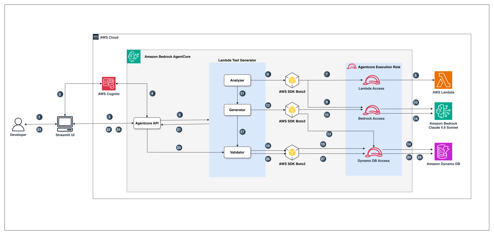

# Lambda Test Case Generator

AI-powered test case generation system for AWS Lambda functions using Amazon Bedrock API for intelligent code analysis and test generation.

## Table of Contents

- [Overview](#overview)
- [Key Features](#key-features)
- [Architecture](#architecture)
- [DynamoDB Architecture](#dynamodb-architecture)
- [Prerequisites](#prerequisites)
- [Complete Infrastructure Deployment](#complete-infrastructure-deployment)
- [Local Streamlit UI](#local-streamlit-ui)
- [Configuration](#configuration)
- [Usage](#usage)
- [How It Works](#how-it-works)
- [Security & IAM Permissions](#security--iam-permissions)
- [Best Practices](#best-practices)
- [Cost Optimization](#cost-optimization)
- [Troubleshooting](#troubleshooting)

## Overview

This system uses a sophisticated 3-agent architecture to analyze AWS Lambda functions and generate high-quality test cases based on **actual code analysis**. It leverages Amazon Bedrock for AI-powered code understanding and Amazon DynamoDB for learning from user feedback.

## Key Features

- **3-Agent Architecture**: Analyzer, Generator, and Validator agents working in concert
- **AI-Powered Code Analysis**: Uses Amazon Bedrock to extract input/output patterns from actual Lambda code
- **Intelligent Test Generation**: Positive (35%), negative (35%), and edge case (30%) scenarios
- **Learning System**: Learns from user feedback to improve over time via DynamoDB memory store
- **Target-Specific Patterns**: Function/class/file-level pattern learning with global fallback
- **Pattern Avoidance**: Automatically avoids previously rejected patterns
- **Zero-Scan Queries**: Optimized DynamoDB schema for fast pattern retrieval

## Architecture



### Complete Flow

1. Developer interacts with Streamlit UI (app.py) running locally, provides Lambda function name, optional custom instructions for test generation, target filter to focus on specific functions/classes/files, and ignore patterns to exclude test files or dependencies

2. Application authenticates request with Cognito and returns JWT (ID/Access token) to Streamlit

3. Streamlit invokes Amazon Bedrock AgentCore API with Bearer Token + payload (function name, filters, instructions, ignore patterns)

4. Amazon Bedrock AgentCore API validates JWT using Cognito token signature

5. Amazon Bedrock AgentCore API routes request to Lambda Test Generator workflow (AgentCore Runtime)

6. Analyzer Agent initiates a request to fetch the target Lambda function's code and metadata

7. Boto3 authenticates with AWS using the AgentCore execution role, requesting read access permissions

8. IAM role authorizes access and fetches Lambda function code as a ZIP file, extracts source files, filters out dependencies (node_modules, venv, etc.) and non-code files, applies user-defined ignore patterns, and chunks code into manageable pieces

9. Boto3 Amazon Bedrock client authenticates with AWS IAM for Amazon Bedrock access, requesting invoke model permissions to use Claude 4.6 Sonnet

10. IAM role authorizes and sends code chunks to Amazon Bedrock (us-east-1) using Claude Sonnet 4.6 model (us.anthropic.claude-sonnet-4-6). Amazon Bedrock performs Regex + LLM enhanced analysis to extract actual input patterns (e.g., event['body'], headers['Authorization']), output patterns (e.g., statusCode, response body structure), dependencies, error handling patterns, and edge cases from the code

11. Analyzer Agent packages the analysis results into an AnalysisResult object containing code chunks, input patterns, output patterns, dependencies, error patterns, and metadata, then passes it to the Generator Agent

12. Generator Agent receives analysis results and initiates a request to generate test cases, first querying DynamoDB memory store for historical patterns to learn from

13. Boto3 DynamoDB client authenticates with AWS IAM for read access permissions to retrieve stored patterns

14. IAM role authorizes and queries DynamoDB memory store table (lambda-testcase-memory) to fetch previously accepted patterns and rejected patterns (failed tests with rejection reasons) for the specific Lambda function

15. Boto3 Amazon Bedrock client authenticates again with AWS IAM for Amazon Bedrock access to generate test cases

16. IAM role authorizes and sends analysis results combined with memory patterns to Amazon Bedrock. Amazon Bedrock generates test case schemas with realistic input events based on actual code patterns, creating positive tests (35%), negative tests (35%), and edge cases (30%). Generation happens per-chunk in parallel for efficiency, applies learned patterns from memory, avoids rejected patterns, and chunks generation if needed for large codebases

17. Generator Agent passes the generated test case candidates to the Validator Agent for quality control, deduplication, and final selection

18. Validator Agent receives test candidates and initiates validation process, requesting access to DynamoDB memory store for scoring and validation 

19. Boto3 DynamoDB client authenticates with AWS IAM for read access to query memory patterns for validation scoring

20. IAM role authorizes and uses DynamoDB memory store to score test cases based on previous pattern success rates, function coverage and code complexity. Validator performs structural validation, deduplication using pattern hashing, quality scoring with confidence boosts for handler functions and error handling, diversity selection to cover different chunks and test types, and selects the top N highest-quality, most diverse test cases

21. Validator Agent returns the final validated test cases with metadata (confidence scores, descriptions, input events, categories) to the main orchestrator, which formats and returns them back to the Amazon Bedrock AgentCore API

22. Amazon Bedrock AgentCore API returns the generated tests back to the Streamlit UI for display with analysis summary, generation metadata, and test case details

23. Developer reviews the displayed test cases in Streamlit UI, evaluates each test for quality and relevance, accepts good test cases or rejects poor ones with specific rejection reasons (missing_auth_headers, wrong_status_code, unrealistic_data, missing_required_fields, incorrect_event_source, etc.) and optional custom notes explaining the rejection, then submits feedback

24. Streamlit UI sends the collected feedback (accepted/rejected status, rejection reasons, custom notes) to the Amazon Bedrock AgentCore API (save_feedback)

25. Amazon Bedrock AgentCore API calls Validator agent which contains logic to store feedback in DynamoDB
 
26. Validator Agent initiates the process to store the feedback

27. Boto3 DynamoDB client authenticates with AWS IAM (Agentcore Execution role) for write access permissions to store feedback patterns

28. IAM role authorizes and stores user feedback in DynamoDB memory store table. Each pattern is stored with a composite partition key (function_name#target_function or function_name#GLOBAL), composite sort key (FEEDBACK#accepted/rejected#PATTERN#hash), pattern hash for deduplication, test type, input pattern structure, feedback status, rejection reason (if rejected), custom notes, usage count, success rate, timestamp, and TTL of 90 days for automatic cleanup. This stored data enables the system to learn from user feedback and improve future test generation

### Agent Responsibilities

1. **Analyzer Agent**
   - Fetches Lambda function code from AWS
   - Uses Amazon Bedrock AI to extract input/output patterns from actual code using chunking
   - Identifies dependencies, error handling, and structure
   - Extracts actual code lines showing field access (e.g., `body.get('email')`)

2. **Generator Agent**
   - Generates test case candidates based on code analysis
   - Retrieves accepted patterns from memory (if available)
   - Analyzes rejection patterns to avoid mistakes
   - Applies rejection avoidance strategies

3. **Validator Agent**
   - Validates test case quality
   - Performs deduplication
   - Filters low-quality tests
   - Ranks by relevance and coverage

## DynamoDB Architecture

The system uses Amazon DynamoDB as an intelligent memory store to enable continuous learning from user feedback. The architecture is optimized for zero-scan queries with composite keys for fast, efficient pattern retrieval.

### Table Schema

**Table Name**: `lambda-testcase-memory`

**Primary Key Structure**:
- **Partition Key (PK)**: `function_target` (String)
  - Format: `{function_name}#{target_function}` or `{function_name}#GLOBAL`
  - Examples: 
    - `my-lambda#validate_user` (target-specific patterns)
    - `my-lambda#GLOBAL` (function-wide patterns)
  - Purpose: Enables target-specific pattern storage and retrieval

- **Sort Key (SK)**: `pattern_sk` (String)
  - Format: `FEEDBACK#{accepted|rejected}#PATTERN#{pattern_hash}`
  - Examples:
    - `FEEDBACK#accepted#PATTERN#abc123def456...`
    - `FEEDBACK#rejected#PATTERN#789xyz012abc...`
  - Purpose: Enables efficient querying by feedback type without scans

**TTL Attribute**: `ttl` (Number)
- Auto-cleanup after 90 days
- Keeps patterns relevant and reduces storage costs

### Key Attributes

| Attribute | Type | Description |
|-----------|------|-------------|
| `function_target` | String | Partition key: `{function}#{target\|GLOBAL}` |
| `pattern_sk` | String | Sort key: `FEEDBACK#{type}#PATTERN#{hash}` |
| `function_name` | String | Lambda function name (for reference) |
| `target_function` | String | Target function/class/file or "GLOBAL" |
| `pattern_hash` | String | SHA-256 hash of test pattern for deduplication |
| `test_type` | String | `positive`, `negative`, or `edge` |
| `category` | String | Test category (e.g., `business_logic`, `error_handling`) |
| `input_pattern` | String | JSON string of input event structure |
| `expected_output_pattern` | String | JSON string of expected output (optional) |
| `feedback` | String | `accepted` or `rejected` |
| `rejection_reason` | String | Predefined rejection reason (if rejected) |
| `custom_reason` | String | User's custom feedback text (if rejected) |
| `user_id` | String | ID of user who provided feedback |
| `timestamp` | String | ISO 8601 timestamp of feedback |
| `usage_count` | Number | Number of times pattern has been used |
| `success_rate` | Number | Success rate (0.0 to 1.0) |
| `ttl` | Number | Unix timestamp for auto-deletion (90 days) |
| `metadata` | Map | Additional metadata (description, confidence score, assertions) |

### Query Patterns (Zero-Scan Design)

The schema is optimized to eliminate table scans using composite keys:

**1. Get Accepted Patterns for Target Function**:
```python
table.query(
    KeyConditionExpression=Key('function_target').eq('my-lambda#validate_user') & 
                          Key('pattern_sk').begins_with('FEEDBACK#accepted')
)
```

**2. Get Accepted Patterns for Entire Function (GLOBAL)**:
```python
table.query(
    KeyConditionExpression=Key('function_target').eq('my-lambda#GLOBAL') & 
                          Key('pattern_sk').begins_with('FEEDBACK#accepted')
)
```

**3. Get Rejected Patterns with Reasons**:
```python
table.query(
    KeyConditionExpression=Key('function_target').eq('my-lambda#validate_user') & 
                          Key('pattern_sk').begins_with('FEEDBACK#rejected')
)
```

**4. Get All Patterns for a Function**:
```python
table.query(
    KeyConditionExpression=Key('function_target').eq('my-lambda#GLOBAL')
)
```

### Pattern Storage Strategy

**Target-Specific vs GLOBAL Patterns**:

1. **Target-Specific Patterns** (`function_name#target_function`):
   - Stored when user provides a target filter (specific function/class/file)
   - More precise and relevant for focused test generation
   - Example: `payment-lambda#process_payment`

2. **GLOBAL Patterns** (`function_name#GLOBAL`):
   - Stored when no target filter is provided
   - Applicable to entire Lambda function
   - Used as fallback when target-specific patterns are insufficient
   - Example: `payment-lambda#GLOBAL`

**Query Strategy**:
- System queries target-specific patterns first (if target provided)
- Falls back to GLOBAL patterns for additional coverage
- Combines both for comprehensive pattern matching

### Learning Mechanism

**Accepted Patterns**:
- Input event structures that worked well
- High success rates indicate reliable patterns
- Usage count tracks popularity
- Reused as templates in future generations

**Rejected Patterns**:
- Input structures that failed validation
- Rejection reasons categorize failure types:
  - `missing_auth_headers`: Authentication/authorization issues
  - `wrong_status_code`: Incorrect expected status codes
  - `unrealistic_data`: Unrealistic or invalid test data
  - `missing_required_fields`: Missing mandatory fields
  - `incorrect_event_source`: Wrong event source format
  - `invalid_json_structure`: Malformed JSON
  - `wrong_assertions`: Incorrect test assertions
  - `incorrect_field_values`: Wrong field value types/formats
  - `missing_edge_cases`: Insufficient edge case coverage
  - `other`: Custom rejection reasons
- Custom feedback provides specific context
- Actively avoided in future generations


## Prerequisites

- **Python**: 3.11 or higher
- **AWS CLI**: Installed and configured (`aws configure`)
- **AWS Account**: With access to Lambda, Amazon Bedrock, DynamoDB, and Cognito
- **Bedrock Model Access**: Anthropic Claude Sonnet 4.6 enabled in us-east-1
- **IAM Permissions**: User/role must have CloudFormation, IAM, DynamoDB, Cognito, Bedrock, and Lambda permissions

### AWS Services Used

- **AWS Lambda**: For fetching function code
- **Amazon Bedrock**: For AI-powered code analysis (Claude 4.6 Sonnet)
- **Amazon DynamoDB**: For memory store
- **Amazon Cognito**: For authentication
- **Amazon Bedrock AgentCore**: For serverless agent runtime

## Complete Infrastructure Deployment

Deploy backend infrastructure (DynamoDB, Cognito, IAM roles) using CloudFormation, then deploy AgentCore backend.

### Step 1: Deploy Complete Infrastructure

```bash
# Deploy infrastructure stack
aws cloudformation create-stack \
  --stack-name lambda-test-generator-infra \
  --template-body file://cloudformation/complete-infrastructure.yaml \
  --capabilities CAPABILITY_NAMED_IAM \
  --region us-east-1

# Wait for completion
aws cloudformation wait stack-create-complete \
  --stack-name lambda-test-generator-infra \
  --region us-east-1

# Get all outputs
aws cloudformation describe-stacks \
  --stack-name lambda-test-generator-infra \
  --query 'Stacks[0].Outputs' \
  --output table
```

**What gets created:**
- DynamoDB table with TTL enabled
- Cognito User Pool with email authentication
- Amazon Bedrock Guardrail with prompt attack, content, and sensitive info filters
- IAM execution role for AgentCore

### Step 2: Export Configuration Variables

```bash
# Export all values from stack outputs
export AGENTCORE_ROLE_ARN=$(aws cloudformation describe-stacks \
  --stack-name lambda-test-generator-infra \
  --query 'Stacks[0].Outputs[?OutputKey==`AgentCoreExecutionRoleArn`].OutputValue' \
  --output text)

export DISCOVERY_URL=$(aws cloudformation describe-stacks \
  --stack-name lambda-test-generator-infra \
  --query 'Stacks[0].Outputs[?OutputKey==`DiscoveryUrl`].OutputValue' \
  --output text)

export CLIENT_ID=$(aws cloudformation describe-stacks \
  --stack-name lambda-test-generator-infra \
  --query 'Stacks[0].Outputs[?OutputKey==`ClientId`].OutputValue' \
  --output text)

export DYNAMODB_TABLE=$(aws cloudformation describe-stacks \
  --stack-name lambda-test-generator-infra \
  --query 'Stacks[0].Outputs[?OutputKey==`DynamoDBTableName`].OutputValue' \
  --output text)

export COGNITO_POOL_ID=$(aws cloudformation describe-stacks \
  --stack-name lambda-test-generator-infra \
  --query 'Stacks[0].Outputs[?OutputKey==`UserPoolId`].OutputValue' \
  --output text)

export BEDROCK_GUARDRAIL_ID=$(aws cloudformation describe-stacks \
  --stack-name lambda-test-generator-infra \
  --query 'Stacks[0].Outputs[?OutputKey==`BedrockGuardrailId`].OutputValue' \
  --output text)

export BEDROCK_GUARDRAIL_VERSION=$(aws cloudformation describe-stacks \
  --stack-name lambda-test-generator-infra \
  --query 'Stacks[0].Outputs[?OutputKey==`BedrockGuardrailVersion`].OutputValue' \
  --output text)

echo "Configuration exported:"
echo "AgentCore Role: $AGENTCORE_ROLE_ARN"
echo "Discovery URL: $DISCOVERY_URL"
echo "Client ID: $CLIENT_ID"
echo "DynamoDB Table: $DYNAMODB_TABLE"
echo "Cognito Pool ID: $COGNITO_POOL_ID"
echo "Bedrock Guardrail ID: $BEDROCK_GUARDRAIL_ID"
echo "Bedrock Guardrail Version: $BEDROCK_GUARDRAIL_VERSION"
```

### Step 3: Install Python Dependencies

```bash
# Create and activate virtual environment (use python3 if python3.11 is not available)
python3.11 -m venv venv || python3 -m venv venv
source venv/bin/activate

# Install required dependencies
pip install -r requirements.txt
```

### Step 4: Configure and Deploy AgentCore

```bash
# Configure AgentCore
agentcore configure \
  --entrypoint main.py \
  --name lambda_test_generator \
  --requirements-file requirements.txt \
  --region us-east-1 \
  --execution-role $AGENTCORE_ROLE_ARN
```

**When prompted:**
1. **Deployment type**: `1` (Direct Code Deploy - no Docker needed)
2. **Python version**: `2` (PYTHON_3_11)
3. **S3 bucket**: Press `Enter` (auto-create)
4. **OAuth authorizer**: `yes`
5. **Discovery URL**: Paste the **actual value** of `$DISCOVERY_URL` (run `echo $DISCOVERY_URL` to see it — the interactive prompt does not expand shell variables)
6. **Client IDs**: Paste the **actual value** of `$CLIENT_ID` (run `echo $CLIENT_ID` to see it)
7. **Audience**: Press `Enter` (leave empty)
8. **Scopes**: Press `Enter` (leave empty)
9. **Custom claims**: Press `Enter` (leave empty)
10. **Request headers**: `yes`
11. **Headers**: `Authorization`
12. **Memory**: `s` (skip - using DynamoDB)
13. **Enable long-term memory**: `no`

> **Important**: The `agentcore configure` interactive prompts do **not** expand shell variables like `$DISCOVERY_URL`. You must paste the actual URL and client ID values. If you accidentally entered literal `$DISCOVERY_URL`, edit `.bedrock_agentcore.yaml` directly or re-run `agentcore configure`.

```bash
# Deploy AgentCore runtime
agentcore deploy \
  --env DYNAMODB_TABLE_NAME=$DYNAMODB_TABLE \
  --env AWS_REGION=us-east-1 \
  --env BEDROCK_GUARDRAIL_ID=$BEDROCK_GUARDRAIL_ID \
  --env BEDROCK_GUARDRAIL_VERSION=$BEDROCK_GUARDRAIL_VERSION

# Get AgentCore runtime ID and endpoint
RUNTIME_ID=$(agentcore status | grep "Agent ARN:" | sed 's/.*runtime\///' | sed 's/[│ ].*//')
AGENTCORE_ENDPOINT="https://bedrock-agentcore-runtime.us-east-1.amazonaws.com/agents/${RUNTIME_ID}/endpoints/DEFAULT"

echo "AgentCore Runtime ID: $RUNTIME_ID"
echo "AgentCore Endpoint: $AGENTCORE_ENDPOINT"
```

**Monitor AgentCore:**
```bash
# View runtime logs (use the log-stream-name-prefix from agentcore status output)
# Note: Log streams are created after the first invocation
agentcore status  # Shows the exact log tail command to use

# View GenAI observability dashboard
echo "Dashboard: https://console.aws.amazon.com/cloudwatch/home?region=us-east-1#gen-ai-observability/agent-core"
```

### Step 5: Create .env File for Local Development

```bash
cat > .env << EOF
AWS_REGION=us-east-1
DYNAMODB_TABLE_NAME=$DYNAMODB_TABLE
COGNITO_POOL_ID=$COGNITO_POOL_ID
COGNITO_CLIENT_ID=$CLIENT_ID
COGNITO_REGION=us-east-1
AGENTCORE_ENDPOINT=$AGENTCORE_ENDPOINT
BEDROCK_GUARDRAIL_ID=$BEDROCK_GUARDRAIL_ID
BEDROCK_GUARDRAIL_VERSION=$BEDROCK_GUARDRAIL_VERSION
EOF

echo ".env file created"
```

### Step 6: Create a Cognito User

The Cognito User Pool uses admin-only user creation for security. Create a user via the AWS CLI:

```bash
# Create a new user (replace user@example.com with your email)
aws cognito-idp admin-create-user \
  --user-pool-id $COGNITO_POOL_ID \
  --username user@example.com \
  --user-attributes Name=email,Value=user@example.com Name=email_verified,Value=true \
  --temporary-password 'TempPass123!' \
  --region us-east-1

# Set a permanent password (min 8 chars, uppercase, lowercase, number)
aws cognito-idp admin-set-user-password \
  --user-pool-id $COGNITO_POOL_ID \
  --username user@example.com \
  --password 'YourSecurePass123!' \
  --permanent \
  --region us-east-1
```

### Step 7: Test with Streamlit UI

```bash
# Run Streamlit UI
streamlit run app.py
```

**Access**: Open browser to `http://localhost:8501`

**First-time setup:**
1. Sign in with the credentials you created in Step 6
2. Start generating test cases

### Cleanup

```bash
# Delete AgentCore runtime
agentcore destroy

# Delete CloudFormation stack (deletes all resources)
aws cloudformation delete-stack \
  --stack-name lambda-test-generator-infra \
  --region us-east-1
```

## Local Streamlit UI

A Streamlit UI is provided for local development and testing. It runs on your machine and connects to the deployed AgentCore backend.

### Running the Streamlit UI

```bash
# Ensure .env file is configured (from Step 4)
streamlit run app.py
```

**Access**: Open browser to `http://localhost:8501`

### Streamlit UI Features

1. **User Authentication**
   - Sign in with Cognito credentials (created via CLI — see Step 6)
   - Secure token-based authentication

2. **Test Generation**
   - Enter Lambda function name
   - Configure target filters and ignore patterns
   - Add custom instructions
   - Generate test cases with one click

3. **Interactive Review**
   - Review generated test cases
   - Accept or reject individual tests
   - Provide detailed rejection feedback
   - Save feedback to improve future generations

4. **Analysis Dashboard**
   - View function analysis summary
   - See generation metadata
   - Track test distribution (positive/negative/edge)

**Note**: The Streamlit UI runs locally and is not deployed to the cloud. It communicates with the AgentCore backend via API calls.

### Deploying Streamlit UI to AWS (Optional)

**SECURITY WARNING**: If you deploy the Streamlit UI to a remote server for team access, you **MUST** use TLS encryption.

The default localhost deployment (`http://localhost:8501`) is secure because it uses the loopback interface with no network exposure. However, remote deployments expose the browser-to-Streamlit connection over the network, which would be unencrypted without TLS.

**Required for Remote Deployment**:
- TLS 1.2 or higher
- Valid SSL/TLS certificate (not self-signed)
- TLS-terminating reverse proxy (ALB, CloudFront, nginx, API Gateway)
- HSTS header enabled
- Network security groups restricting access

**Deployment Options**:

1. **Application Load Balancer (ALB) with ACM Certificate** (Recommended):
   - Terminates TLS at the load balancer
   - Free SSL/TLS certificates via AWS Certificate Manager
   - Automatic certificate renewal
   - See: [AWS ALB Documentation](https://docs.aws.amazon.com/elasticloadbalancing/latest/application/)

2. **CloudFront with ACM Certificate**:
   - Global CDN with TLS termination
   - DDoS protection via AWS Shield
   - See: [CloudFront SSL/TLS Documentation](https://docs.aws.amazon.com/AmazonCloudFront/latest/DeveloperGuide/using-https.html)

3. **nginx Reverse Proxy with Let's Encrypt**:
   - Free SSL/TLS certificates
   - Automatic renewal with certbot
   - See: [Let's Encrypt Documentation](https://letsencrypt.org/getting-started/)

**Reference Guide**:

For deploying Streamlit to AWS with proper TLS configuration, refer to this guide:

**[Accelerate Serverless Streamlit App Deployment with Terraform](https://aws.amazon.com/blogs/devops/accelerate-serverless-streamlit-app-deployment-with-terraform/)**

**Note**: Ensure you add TLS termination (ALB with ACM certificate) to any deployment based on this guide.


## Configuration

### Environment Variables

| Variable | Required | Default | Description |
|----------|----------|---------|-------------|
| `AWS_REGION` | Yes | - | AWS region for services |
| `DYNAMODB_TABLE_NAME` | Yes | - | DynamoDB table for memory store |
| `COGNITO_POOL_ID` | Yes | - | Cognito User Pool ID for authentication |
| `COGNITO_CLIENT_ID` | Yes | - | Cognito App Client ID |
| `COGNITO_REGION` | Yes | `us-east-1` | Cognito User Pool region |
| `BEDROCK_GUARDRAIL_ID` | Recommended | - | Amazon Bedrock Guardrail ID (from CloudFormation outputs) |
| `BEDROCK_GUARDRAIL_VERSION` | Recommended | - | Amazon Bedrock Guardrail version (from CloudFormation outputs) |

### Amazon Bedrock Models

Supported models:
- `us.anthropic.claude-sonnet-4-6`

## Usage

You can interact with the system in two ways:
1. **Streamlit UI** (recommended for interactive use) - runs locally on your machine
2. **Direct API calls** (for automation/integration) - invoke AgentCore backend directly

### Option 1: Using the Streamlit UI (Recommended)

The Streamlit UI provides an interactive interface for generating and reviewing test cases.

**Start the UI:**
```bash
# Ensure .env file is configured
streamlit run app.py
```

**Access**: Open browser to `http://localhost:8501`

**Workflow:**
1. **Sign In** - Authenticate with Cognito credentials
2. **Configure** - Enter Lambda function name, target filter, custom instructions
3. **Generate** - Click "Generate Test Cases" and wait for results
4. **Review** - Examine each test case with confidence scores and descriptions
5. **Provide Feedback** - Accept good tests, reject poor ones with specific reasons
6. **Save** - Store feedback to DynamoDB to improve future generations

**Create Cognito Users:**
```bash
# Create a new user
aws cognito-idp admin-create-user \
  --user-pool-id $COGNITO_POOL_ID \
  --username user@example.com \
  --user-attributes Name=email,Value=user@example.com Name=email_verified,Value=true \
  --temporary-password 'TempPass123!' \
  --region us-east-1

# Set permanent password
aws cognito-idp admin-set-user-password \
  --user-pool-id $COGNITO_POOL_ID \
  --username user@example.com \
  --password 'SecurePass123!' \
  --permanent \
  --region us-east-1
```

### Option 2: Direct API Invocation (For Automation)

The backend is deployed on Amazon Bedrock AgentCore and can be invoked via API calls with Amazon Cognito authentication.

**1. Get Cognito Token:**
```bash
# Using agentcore CLI (requires env vars: RUNTIME_POOL_ID, RUNTIME_CLIENT_ID)
export RUNTIME_POOL_ID=$COGNITO_POOL_ID
export RUNTIME_CLIENT_ID=$CLIENT_ID
TOKEN=$(agentcore identity get-cognito-inbound-token \
  --pool-id $COGNITO_POOL_ID \
  --client-id $CLIENT_ID \
  --username user@example.com \
  --password 'YourPassword123!')

# Or authenticate manually with Cognito
aws cognito-idp initiate-auth \
  --auth-flow USER_PASSWORD_AUTH \
  --client-id $CLIENT_ID \
  --auth-parameters USERNAME=user@example.com,PASSWORD=YourPassword123! \
  --region us-east-1
```

**2. Invoke Test Generation:**
```bash
# Using agentcore CLI
agentcore invoke --bearer-token "$TOKEN" '{
  "action": "generate_test_cases",
  "function_name": "your-lambda-function",
  "num_test_cases": 10,
  "custom_instructions": "Focus on authentication scenarios",
  "target_filter": "validate_user",
  "ignore_patterns": ["tests/", "*.test.js"]
}'

# Or using curl
curl -X POST "$AGENTCORE_ENDPOINT" \
  -H "Authorization: Bearer $TOKEN" \
  -H "Content-Type: application/json" \
  -d '{
    "action": "generate_test_cases",
    "function_name": "your-lambda-function",
    "num_test_cases": 10
  }'
```

### API Request Format

**Generate Test Cases:**
```json
{
  "action": "generate_test_cases",
  "function_name": "my-lambda-function",
  "num_test_cases": 10,
  "custom_instructions": "Optional custom instructions",
  "target_filter": "Optional function/class/file to focus on",
  "ignore_patterns": ["tests/", "*.spec.py"]
}
```

**Response Format:**
```json
{
  "success": true,
  "output": "Formatted test cases with analysis summary..."
}
```

## How It Works

### 1. Code Analysis with Amazon Bedrock AI

The Analyzer Agent:
1. Fetches your Lambda function code from AWS
2. Sends code to Amazon Bedrock AI for deep analysis
3. Extracts **actual code patterns** like:
   - `dashboard_id = body.get('dashboard_id')`
   - `email = body.get('email')`
   - `event['Records']`
   - `return {'statusCode': 200, 'body': json.dumps(response)}`

### 2. Test Case Generation

The Generator Agent:
1. Uses extracted patterns to build realistic test inputs
2. Infers field types and values:
   - `email` → `user@example.com`
   - `dashboard_id` → `dashboard-123`
   - `count` → `10`
3. Generates three types of tests:
   - **Positive** (35%): Valid inputs that should succeed
   - **Negative** (35%): Invalid inputs that should fail gracefully
   - **Edge Cases** (30%): Boundary conditions

### 3. Validation and Ranking

The Validator Agent:
1. Checks test case quality
2. Removes duplicates
3. Ranks by relevance
4. Returns top N test cases

## Test Case Types

### Positive Tests
Valid inputs based on actual code:
```json
{
  "test_type": "positive",
  "input_event": {
    "body": "{\"dashboard_id\": \"dash-123\", \"sheet_id\": \"sheet-456\", \"visual_id\": \"visual-789\", \"email\": \"user@example.com\"}"
  },
  "expected_output": {
    "statusCode": 200,
    "body": "{\"status\": \"success\"}"
  }
}
```

### Negative Tests
Invalid inputs to test error handling:
```json
{
  "test_type": "negative",
  "input_event": {
    "body": "{\"dashboard_id\": null}"
  },
  "expected_output": {
    "statusCode": 400,
    "body": "{\"error\": \"Invalid input\"}"
  }
}
```

### Edge Cases
Boundary conditions:
```json
{
  "test_type": "edge",
  "input_event": {
    "body": "{\"dashboard_id\": \"\", \"email\": \"invalid-email\"}"
  },
  "expected_output": {
    "statusCode": 400
  }
}
```

## Security & IAM Permissions

### Security Architecture

The system implements multiple layers of security to protect sensitive data:

**1. Source Code Protection**
- Lambda source code is fetched and analyzed internally by the agents
- A sanitization layer removes all source code before returning results
- Only metadata (patterns, inputs, outputs) is exposed in API responses
- Even if the AgentCore endpoint is compromised, source code cannot be extracted

**2. Authentication & Authorization**
- Amazon Cognito provides user authentication with JWT tokens
- Amazon Bedrock AgentCore validates JWT tokens on every request
- IAM roles control which Lambda functions can be accessed
- Optional IAM conditions can restrict access by tags or naming patterns

**3. Prompt Injection Protection**
- Custom instructions are sanitized before being sent to Bedrock
- Malicious patterns are filtered (e.g., "ignore previous instructions")
- Amazon Bedrock Guardrail attached to all model invocations with:
  - Prompt attack filter (HIGH) — blocks jailbreaks and instruction overrides
  - Content filters (HIGH) — blocks harmful content generation
  - Sensitive information filter — redacts PII and blocks AWS keys, private keys, JWT tokens
  - Denied topics — blocks exploit code generation and raw source code output
  - Contextual grounding check — reduces hallucinated test cases
- Bedrock prompts include explicit security rules
- System never outputs full source code even if prompted

**4. Session Security (Streamlit UI)**
- Tokens stored server-side, never in URLs or cookies
- No exposure via browser history or Referer headers
- Session expires when browser tab closes

**5. Input Validation**
- **All AgentCore API inputs are validated before processing**
- **Amazon Cognito provides user authentication with JWT tokens**
- **Amazon Bedrock AgentCore validates JWT tokens on every request**

### Required Permissions

Ensure your AWS CLI user/role has the permissions listed in the [Prerequisites](#required-iam-permissions) section.

### Minimum Required Permissions (Alternative)

If you prefer a minimal policy without KMS access, replace `ACCOUNT_ID` with your AWS account ID and `GUARDRAIL_ID` with the guardrail ID from CloudFormation outputs:

```json
{
  "Version": "2012-10-17",
  "Statement": [
    {
      "Sid": "LambdaReadAccess",
      "Effect": "Allow",
      "Action": [
        "lambda:GetFunction",
        "lambda:GetFunctionConfiguration"
      ],
      "Resource": "arn:aws:lambda:us-east-1:ACCOUNT_ID:function:*",
      "Condition": {
        "StringEquals": {
          "aws:ResourceTag/AllowTestGeneration": "true"
        }
      }
    },
    {
      "Sid": "BedrockInvokeAccess",
      "Effect": "Allow",
      "Action": [
        "bedrock:InvokeModel",
        "bedrock:InvokeModelWithResponseStream"
      ],
      "Resource": [
        "arn:aws:bedrock:us-east-1::foundation-model/us.anthropic.claude-sonnet-4-6",
        "arn:aws:bedrock:us-east-1:ACCOUNT_ID:inference-profile/us.anthropic.claude-sonnet-4-6"
      ]
    },
    {
      "Sid": "BedrockGuardrailAccess",
      "Effect": "Allow",
      "Action": [
        "bedrock:ApplyGuardrail"
      ],
      "Resource": "arn:aws:bedrock:us-east-1:ACCOUNT_ID:guardrail/GUARDRAIL_ID"
    },
    {
      "Sid": "DynamoDBMemoryStore",
      "Effect": "Allow",
      "Action": [
        "dynamodb:Query",
        "dynamodb:GetItem",
        "dynamodb:PutItem",
        "dynamodb:UpdateItem",
        "dynamodb:BatchWriteItem",
        "dynamodb:DescribeTable"
      ],
      "Resource": "arn:aws:dynamodb:us-east-1:ACCOUNT_ID:table/lambda-testcase-memory*"
    }
  ]
}
```

> **Lambda access control**: The policy above uses a tag-based condition so only Lambda functions tagged with `AllowTestGeneration=true` can be analyzed. Tag your functions:
> ```bash
> aws lambda tag-resource \
>   --resource arn:aws:lambda:us-east-1:ACCOUNT_ID:function:my-function \
>   --tags AllowTestGeneration=true
> ```
> For development environments where you need to analyze any function, you can remove the `Condition` block — but this grants read access to all functions in the account/region (documented as security debt SD-7 in [SECURITY.md](SECURITY.md)).
```

### Security Best Practices

1. **Principle of Least Privilege**
   - Grant only necessary permissions
   - Use resource-specific ARNs when possible
   - Avoid wildcard (*) resources in production
   - Review IAM policies regularly and remove unused permissions

2. **Credential Management**
   - Never hardcode credentials
   - Use IAM roles for EC2/ECS deployments
   - Rotate access keys regularly
   - Use AWS Secrets Manager for sensitive data

3. **Network Security**
   - Use VPC endpoints for AWS services
   - Enable encryption in transit (TLS)
   - Restrict outbound internet access

4. **Data Protection**
   - DynamoDB encryption at rest (enabled by default)
   - Enable CloudTrail for audit logging
   - Implement data retention policies (TTL)
   - Use AWS-managed encryption for non-sensitive data; customer-managed KMS for sensitive data

5. **Access Control**
   - Use separate IAM users/roles per environment
   - Enable MFA for sensitive operations and production environments
   - Implement resource tagging for access control
   - For development tools, balance security with usability (optional MFA acceptable)

6. **Prompt Injection Protection**
   - Amazon Bedrock Guardrail attached to all model invocations with prompt attack, content, sensitive info, and denied topic filters
   - Custom instructions are sanitized to prevent prompt injection attacks
   - System removes attempts to override security rules or extract source code
   - Filters malicious patterns like "ignore previous instructions"
   - Limits instruction length to prevent token exhaustion
   - Bedrock prompts include explicit security rules that cannot be overridden
   - All user input is treated as untrusted and sanitized before use

7. **Secure Session Management (Streamlit UI)**
   - Authentication tokens stored server-side in Streamlit session state
   - Tokens never exposed in URLs, browser history, or Referer headers
   - No token leakage via URL sharing or shoulder surfing
   - Session expires when browser tab closes
   - Automatic token refresh without exposing credentials

8. **Source Code Protection**
   - Lambda source code is analyzed internally but never returned to users
   - Only metadata and patterns (inputs/outputs) are exposed in API responses
   - Sanitization layer removes all code chunks before returning results
   - IAM conditions can restrict which Lambda functions can be analyzed
   - Prevents unauthorized source code disclosure even if API is compromised

6. **IAM Access Analyzer**
   - Enable IAM Access Analyzer in your AWS account
   - Configure continuous monitoring of resource permissions
   - Review findings regularly to identify unintended access
   - Set up automated alerts for new findings
   - Use Access Analyzer to validate IAM policies before deployment
   - Monitor external access to DynamoDB tables and Lambda functions
   
   **To enable IAM Access Analyzer:**
   ```bash
   # Create an analyzer for your account
   aws accessanalyzer create-analyzer \
       --analyzer-name lambda-test-generator-analyzer \
       --type ACCOUNT \
       --region us-east-1
   
   # List findings
   aws accessanalyzer list-findings \
       --analyzer-arn arn:aws:access-analyzer:us-east-1:ACCOUNT_ID:analyzer/lambda-test-generator-analyzer \
       --region us-east-1
   ```

7. **Authentication & Authorization**
   - Use strong password policies (min 8 chars, uppercase, lowercase, numbers, symbols)
   - Enable Cognito AdvancedSecurityMode for threat detection
   - Implement token expiration and refresh mechanisms
   - Validate JWT tokens on every API request
   - Use least-privilege IAM roles for service-to-service communication

## Best Practices

### Test Generation

1. **Start with Target-Specific Generation**
   - Focus on specific functions/classes for better accuracy
   - Use GLOBAL patterns as fallback

2. **Provide Clear Custom Instructions**
   - Specify authentication requirements
   - Mention expected event sources (API Gateway, S3, etc.)
   - Include business logic constraints

3. **Review and Provide Feedback**
   - Always review generated test cases
   - Provide specific rejection reasons
   - Accept high-quality tests to improve learning

4. **Iterative Improvement**
   - Generate tests multiple times
   - System improves with each feedback cycle
   - Monitor success rates in DynamoDB

### DynamoDB Memory Store

1. **Enable TTL**
   - Automatically cleanup old patterns (90 days)
   - Reduces storage costs
   - Keeps patterns relevant

2. **Monitor Usage**
   - Track `usage_count` and `success_rate`
   - Identify high-performing patterns
   - Remove consistently rejected patterns

3. **Target-Specific vs GLOBAL**
   - Use target-specific for function-level patterns
   - Use GLOBAL for common patterns across Lambda
   - System automatically queries both

### Performance

1. **Batch Operations**
   - Generate multiple test cases at once
   - Use BatchWriteItem for feedback storage

2. **Caching**
   - Cache Lambda function code locally during session
   - Reuse Amazon Bedrock responses when possible

3. **Parallel Processing**
   - Agents can work in parallel
   - Use async operations for I/O

## Cost Optimization

### DynamoDB

- **Pay-Per-Request Billing**: No upfront costs, pay only for reads/writes
- **TTL Auto-Cleanup**: Patterns deleted after 90 days (no cost)
- **No GSIs**: Reduced storage costs and faster writes
- **Estimated Cost**: $0.01-$0.10 per 1000 test generations

### Amazon Bedrock

- **On-Demand Pricing**: Pay per token
- **Estimated Cost**: $0.50-$2.00 per 100 test generations
- **Optimization**: Use smaller code chunks, cache results

### Lambda

- **Read-Only Operations**: No Lambda invocation costs
- **GetFunction API**: Free tier covers most usage

### Total Estimated Cost

- **Light Usage** (100 tests/month): $1-3/month
- **Medium Usage** (1000 tests/month): $10-30/month
- **Heavy Usage** (10000 tests/month): $100-300/month

## Troubleshooting

### Common Issues

**1. "Access Denied" Error**
```
Solution: Verify IAM permissions for Lambda, Amazon Bedrock, and DynamoDB
Check: aws sts get-caller-identity
```

**2. "Model Not Found" Error**
```
Solution: Enable Amazon Bedrock model access in AWS Console
Navigate: Amazon Bedrock → Model access → Enable Claude 4.6 Sonnet
```

**3. "DynamoDB Table Not Found"**
```
Solution: Verify table name from CloudFormation outputs or use the name you created
CloudFormation: aws cloudformation describe-stacks --stack-name lambda-testcase-memory --query 'Stacks[0].Outputs[?OutputKey==`TableName`].OutputValue' --output text
Direct CLI: aws dynamodb describe-table --table-name lambda-testcase-memory
```

**4. "No Test Cases Generated"**
```
Solution: Check Lambda function code is accessible
Verify: Lambda function exists and has code
Check: Custom instructions are not too restrictive
```

**5. "Poor Test Quality"**
```
Solution: Provide feedback to improve learning
Action: Accept good tests, reject bad tests with specific reasons
Wait: System improves after 5-10 feedback cycles
```

**6. AgentCore: "Agent not found"**
```
Solution: Verify agent is deployed
Check: agentcore status
Check: agentcore configure list
```

**7. AgentCore: "Failed to push image to ECR"**
```
Solution: Authenticate Docker with ECR before launching
Run: ACCOUNT_ID=$(aws sts get-caller-identity --query Account --output text)
Run: aws ecr get-login-password --region us-east-1 | docker login --username AWS --password-stdin ${ACCOUNT_ID}.dkr.ecr.us-east-1.amazonaws.com
If agentcore launch still fails to push, build and push manually:
  docker build -t bedrock_agentcore-lambda_test_generator .
  docker tag bedrock_agentcore-lambda_test_generator:latest ${ACCOUNT_ID}.dkr.ecr.us-east-1.amazonaws.com/bedrock_agentcore-lambda_test_generator:latest
  docker push ${ACCOUNT_ID}.dkr.ecr.us-east-1.amazonaws.com/bedrock_agentcore-lambda_test_generator:latest
```

**8. macOS: "error storing credentials - The specified item already exists in the keychain"**
```
Solution: Docker's osxkeychain credential store conflicts with ECR tokens.
Fix: Switch to file-based credential storage:
  mkdir -p ~/.docker
  echo '{"auths":{}}' > ~/.docker/config.json
Then retry docker login.
```

**9. AgentCore: "Container failed to start"**
```
Solution: Check CloudWatch logs for the agent
Check: Ensure Docker is running during deployment
Check: Verify all dependencies are in requirements.txt
```

**10. AgentCore: "Permission denied" at runtime**
```
Solution: Verify execution role has correct policies
Check: aws iam get-role-policy --role-name lambda-testgen-agentcore-role --policy-name AgentCoreExecutionPolicy
```

**11. AgentCore: "Access denied while validating ECR URI"**
```
Solution: The execution role needs ECR permissions to pull the container image.
Fix: Add these permissions to the execution role policy:
  - ecr:GetAuthorizationToken (Resource: *)
  - ecr:BatchGetImage (Resource: your ECR repository ARN)
  - ecr:GetDownloadUrlForLayer (Resource: your ECR repository ARN)
These are already included in deployment/execution-policy.json.
Apply: aws iam put-role-policy --role-name lambda-testgen-agentcore-role --policy-name AgentCoreExecutionPolicy --policy-document file://deployment/execution-policy.json
Wait ~10 seconds for IAM propagation before retrying agentcore launch.
```

**12. AgentCore: "Invalid agent name"**
```
Solution: Agent names must start with a letter, contain only letters/numbers/underscores, and be 1-48 characters
Use: lambda_test_generator (underscores, not hyphens)
```

**13. AgentCore uses wrong container runtime**
```
Solution: Check .bedrock_agentcore.yaml in your project root
Ensure container_runtime is set to "docker" (not "finch")
If using Colima, unset DOCKER_HOST so Docker uses the default Colima socket
```

**14. AgentCore: "Role validation failed" or "trust policy allows assumption by this service"**
```
Solution: The execution role trust policy must use "bedrock-agentcore.amazonaws.com" as the service principal.
Common mistake: Using "bedrock.amazonaws.com" instead — this is the wrong principal for AgentCore Runtime.
Fix: Update the trust policy:
  aws iam update-assume-role-policy \
    --role-name lambda-testgen-agentcore-role \
    --policy-document file://deployment/trust-policy.json
Verify: aws iam get-role --role-name lambda-testgen-agentcore-role --query 'Role.AssumeRolePolicyDocument'
Wait ~10 seconds for IAM propagation before retrying agentcore launch.
```

**15. "Unknown service: bedrock-agentcore-control"**
```
Solution: Your boto3/botocore version is too old and doesn't include the AgentCore service.
Fix: Ensure Python 3.11+ and upgrade dependencies:
  python3.11 -m venv venv
  source venv/bin/activate
  pip install -r requirements.txt
Verify: pip show boto3 | grep Version  (should be >= 1.42.75)
```

**16. Cognito: "Invalid username or password"**
```
Solution: Use the test credentials from .agentcore_identity_user.env
Check: cat .agentcore_identity_user.env | grep RUNTIME_USERNAME
Check: cat .agentcore_identity_user.env | grep RUNTIME_PASSWORD
Or create a new user:
  aws cognito-idp admin-create-user --user-pool-id <POOL_ID> --username <username> --temporary-password '<password>' --region us-east-1
  aws cognito-idp admin-set-user-password --user-pool-id <POOL_ID> --username <username> --password '<password>' --permanent --region us-east-1
```

**17. Cognito: "401 Unauthorized" when invoking agent**
```
Solution: Agent authorizer configuration may be incorrect or missing.
Check: Verify .bedrock_agentcore.yaml has authorizer_configuration with customJWTAuthorizer
Check: Ensure discoveryUrl and allowedClients match your Cognito pool
Fix: Redeploy agent with correct authorizer:
  agentcore launch --env DYNAMODB_TABLE_NAME=<table> --env AWS_REGION=us-east-1
Test: agentcore invoke --bearer-token "$(agentcore identity get-cognito-inbound-token)" '{"action": "health_check"}'
```

### Debug Mode

```bash
# Enable debug logging
export LOG_LEVEL=DEBUG

# Test AgentCore locally before deploying
agentcore launch --local

# View AgentCore logs
aws logs tail /aws/bedrock-agentcore/lambda_test_generator --follow
```

## Security

See [CONTRIBUTING](CONTRIBUTING.md#security-issue-notifications) for more information.

## License

This library is licensed under the MIT-0 License. See the LICENSE file.